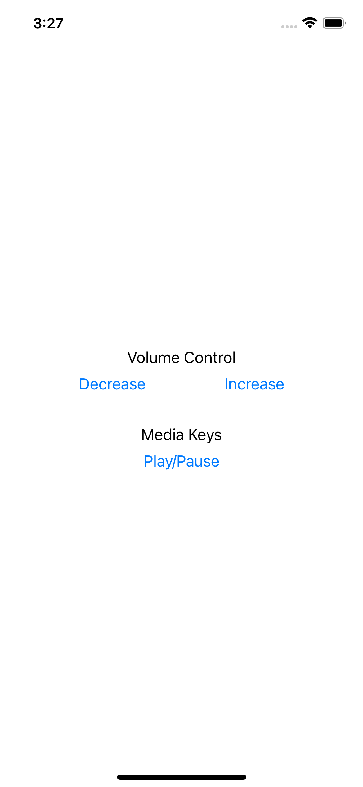
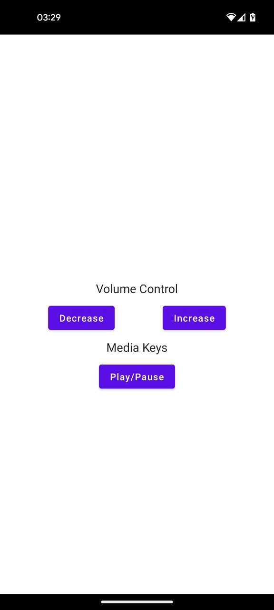

# Media Remote Control App

## What

Simple Server-Client App that allows you to use media control (or keys) remotelly using mobile application (in future web page)

## Why
- Stop media player of desktop from longer than bluetooth range
- Using Desktop as TV more pleasant
- etc.

## How

### Client

Noting special just UI that send api calls.

| ios | android |
|-----|---------|
|  |  |

#### Implmented

- In Kotlin multiplatform

### Server

- Volume 
Checks using volume-go 
    - For macOS uses apple scripts to fetch and update volume

- Media Keys

    - Windows/Linux   : Simulation of keyboard presses
    - Mac             : Simulates AUX keys (similar to wired headphone)

#### TODO

- Client
    - [ ] UI enchancement
    - [ ] Tests
- Docs
    - [ ] Dependencies list
- Server
    - [ ] Better and Convient logging

#### Tested/Developed on

MacBook Pro 2019 (touchbar)

#### Didn't work out

- Using keyboard "Media keys" on Mac (F8)
Doesn't worked assume because of Touchbar, also might be application specific

#### Possible to explore

- Using bluetooth canal
Using AVRCP (if used probably could be used for excange server IP?)

- Using Pushes for syncing IP?

- Static Domain for IP

- Fully Remote Server

- "Go to sleep mode" command

- Rewrite server logic in C

# Future

- [ ] Info about currently playing in Desktop
    - [ ] Transfer currently playing to mobile (cutomizable actions where to lead e.g. Spotify/SoundCloud/Etc)
- [ ] Seeing what is playing on mobile from Desktop
    - [ ] Send currently playing to the desktop
- [ ] Some animation (loading) shared between client and server (rendered differently)
    - [ ] OpenGL in mobile
    - [ ] ACII   in Server CLI / Build CLI
    - [ ] WebGPU in Web